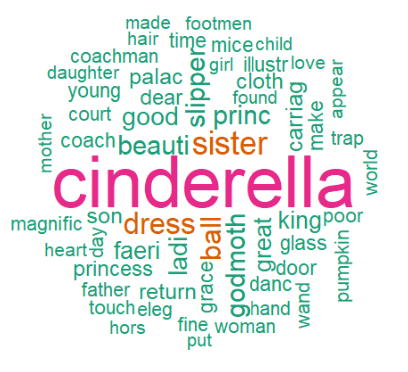

<h1 align="center">📕 Text mining project 📘 
: 두 편의 e-book data의 감정분석 결과와  책의 결말 사이 관계 연구 </h1>

## 📍 Quick overview

<strong>Text mining 을 통해 책의 전반적인 감정분석 결과와 책의 결말 사이에는 어떤 관계가 있는지 알아보고자 한다.</strong> 
보통 책의 결말은 책의 맨 마지막 문단 혹은 마지막 문장을 보면 알 수 있다고 가정한다.

1) **텍스트 데이터 수집**
> 텍스트 데이터는 Project Gutenberg 에서 무료로 제공하는 e-book 데이터를 사용. 
비교를 위해 대표적인 해피엔딩과 새드엔딩을 가진 책 2권의 텍스트 데이터를 사용하였다.

2) **Data Preprocessing**
>  숫자 표현, 고유 명사, 특수문자 사용 전후의 단어 살피기 등 

3) **EDA**
>  DTM 구축, 빈도표, 누적 빈도 계산, WordCloud 그리기

4) **감정 분석**
 > `textdata` 라이브러리에 내장되어 있는 사전 데이터(dictionary-based)를 활용하여 감정분석

- 자세한 내용은 아래 최종 발표 자료를 참고해주세요

  
## 💁🏻‍♀️ 발표 자료

- 최종 발표 자료 ([link](https://github.com/hanakim120/e-book-text-mining/blob/main/Text_mining_project.pdf))

## 🛠️ Skills
- R 3.6.1 

- 사용한 library 
	- tm, tidyverse, stringr, topicmodels, wordcloud, RColorBrewer, tidytext, dplyr

## 🗂️ 사용한 데이터

### Raw 데이터 수집 경로 

-   Project Gutenberg 에서 무료로 제공하는 e-book 데이터를 사용. ([project gutenberg](https://www.gutenberg.org/))
1) The Strange Case of Dr. Jekyll and Mr. Hyde by Robert Louis Stevenson
2) Cinderella by Henry W. Hewet

## 📊  Data preprocessing

1. 말뭉치에 등장한 숫자표현들은 모두 삭제.  
2. 말뭉치에 사용된 특수문자들의 경우 두 단계를 통해 사전처리.
	- ᄀ. 표에 따라 몇몇 표현들을 교체.
	- ᄂ. 2-ᄀ에 해당되지 않는 특수문자들은 일괄 삭제.  
	
	
|jekyll data|Cinderella data|
|:-:|:-:|
|||
	

3. 2번 이상 연이어 나타난 공란들은 하나의 스페이스 공란(” “)으로 바꿈. 
5. 대문자로 나타난 텍스트는 모두 소문자로 전환.  
6. tm 라이브러리에 탑재된 SMART 불용문자 목록에 포함되어 있는 단어들을 모두 삭제.  
7. 어근이 동일하지만 문법적으로 변용된 단어들을 통합하는 어근 동일화 알고리즘을 적용.

## 📝 EDA
### WordCloud
DTM 을 구축하고 누적 빈도수를 계산하여 가장 자주 등장한단어를 1~20등 살펴본다. 

|jekyll DTM|Cinderella DTM|
|:-:|:-:|
|||
	

|jekyll 데이터의 WordCloud|Cinderella 데이터의 WordCloud|
|:-:|:-:|
|||	

## 🤖 감정분석 
	
|jekyll 데이터의 감정분석 결과  긍정적인 단어보다 부정적인 단어가 237개 더 많이 나옴|cinderella 데이터의 감정분석 결과  부정적인 단어보다 긍정적인 단어가 97개 더 많이 나옴|
|:-:|:-:|
|||
	

## 💻 Results 

- 새드엔딩인 책은 전반적으로 부정적인 단어가 많이 등장  
- 해피엔딩인 책은 전반적으로 긍정적인 단어가 많이 등장

> 텍스트 데이터를 두 권으로만 분석했기 때문에 더 많은 데이터로 분석해 봐야 할 필요성이 있고, 중간에 반전이 있는 책에서도 같은 결과가 나올지, 챕터 별 로 감정분석을 실시하면 기승전결의 파트 중 어느 파트에 어떤 감정 어휘가 있느냐에 따라 결말이 어떻게 되는지 또한 분석해 보고 싶다.

## 📃 Book References

-   백영민, 『R을 이용한 텍스트 마이닝』, 한울아카데미(2017)
    
## License

)

- Copyright © [Hana Kim](https://github.com/hanakim120).